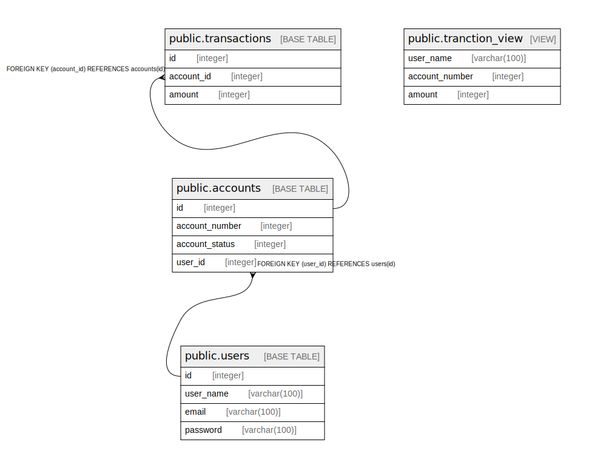

# testdb

## Tables

| Name | Columns | Comment | Type |
| ---- | ------- | ------- | ---- |
| [public.users](public.users.md) | 4 |  | BASE TABLE |
| [public.accounts](public.accounts.md) | 4 |  | BASE TABLE |
| [public.transactions](public.transactions.md) | 3 |  | BASE TABLE |
| [public.tranction_view](public.tranction_view.md) | 3 |  | VIEW |

## Stored procedures and functions

| Name | ReturnType | Arguments | Type |
| ---- | ------- | ------- | ---- |
| public.generate_test_data | void | num_users integer, num_accounts_per_user integer, num_transactions_per_account integer | FUNCTION |

## Relations

---

> Generated by [tbls](https://github.com/k1LoW/tbls)
