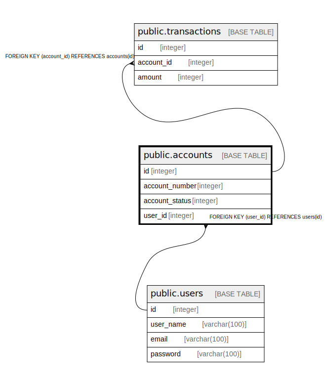

# public.accounts

## Description

## Columns

| Name | Type | Default | Nullable | Children | Parents | Comment |
| ---- | ---- | ------- | -------- | -------- | ------- | ------- |
| id | integer | nextval('accounts_id_seq'::regclass) | false | [public.transactions](public.transactions.md) |  |  |
| account_number | integer |  | false |  |  |  |
| account_status | integer |  | false |  |  |  |
| user_id | integer |  | false |  | [public.users](public.users.md) |  |

## Constraints

| Name | Type | Definition |
| ---- | ---- | ---------- |
| fk_user_id | FOREIGN KEY | FOREIGN KEY (user_id) REFERENCES users(id) |
| accounts_pkey | PRIMARY KEY | PRIMARY KEY (id) |
| accounts_account_number_key | UNIQUE | UNIQUE (account_number) |

## Indexes

| Name | Definition |
| ---- | ---------- |
| accounts_pkey | CREATE UNIQUE INDEX accounts_pkey ON public.accounts USING btree (id) |
| accounts_account_number_key | CREATE UNIQUE INDEX accounts_account_number_key ON public.accounts USING btree (account_number) |

## Relations

---

> Generated by [tbls](https://github.com/k1LoW/tbls)
