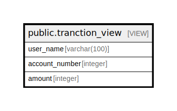

# public.tranction_view

## Description

<details>
<summary><strong>Table Definition</strong></summary>

```sql
CREATE VIEW tranction_view AS (
 SELECT u.user_name,
    a.account_number,
    t.amount
   FROM ((users u
     JOIN accounts a ON ((a.user_id = u.id)))
     JOIN transactions t ON ((t.account_id = a.id)))
)
```

</details>

## Referenced Tables

- [public.users](public.users.md)
- [public.accounts](public.accounts.md)
- [public.transactions](public.transactions.md)

## Columns

| Name | Type | Default | Nullable | Children | Parents | Comment |
| ---- | ---- | ------- | -------- | -------- | ------- | ------- |
| user_name | varchar(100) |  | true |  |  |  |
| account_number | integer |  | true |  |  |  |
| amount | integer |  | true |  |  |  |

## Relations



---

> Generated by [tbls](https://github.com/k1LoW/tbls)
