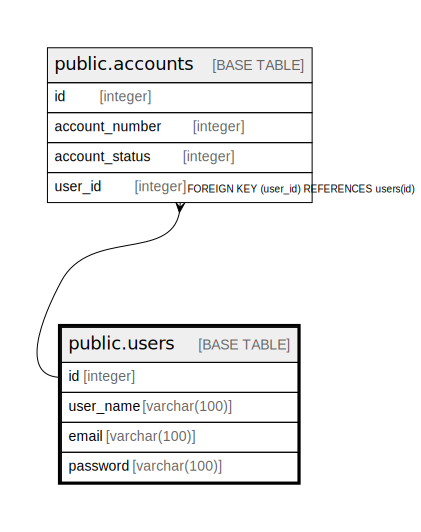

# public.users

## Description

## Columns

| Name | Type | Default | Nullable | Children | Parents | Comment |
| ---- | ---- | ------- | -------- | -------- | ------- | ------- |
| id | integer | nextval('users_id_seq'::regclass) | false | [public.accounts](public.accounts.md) |  |  |
| user_name | varchar(100) |  | false |  |  |  |
| email | varchar(100) |  | false |  |  |  |
| password | varchar(100) |  | false |  |  |  |

## Constraints

| Name | Type | Definition |
| ---- | ---- | ---------- |
| users_pkey | PRIMARY KEY | PRIMARY KEY (id) |
| users_email_key | UNIQUE | UNIQUE (email) |

## Indexes

| Name | Definition |
| ---- | ---------- |
| users_pkey | CREATE UNIQUE INDEX users_pkey ON public.users USING btree (id) |
| users_email_key | CREATE UNIQUE INDEX users_email_key ON public.users USING btree (email) |

## Relations

---

> Generated by [tbls](https://github.com/k1LoW/tbls)
