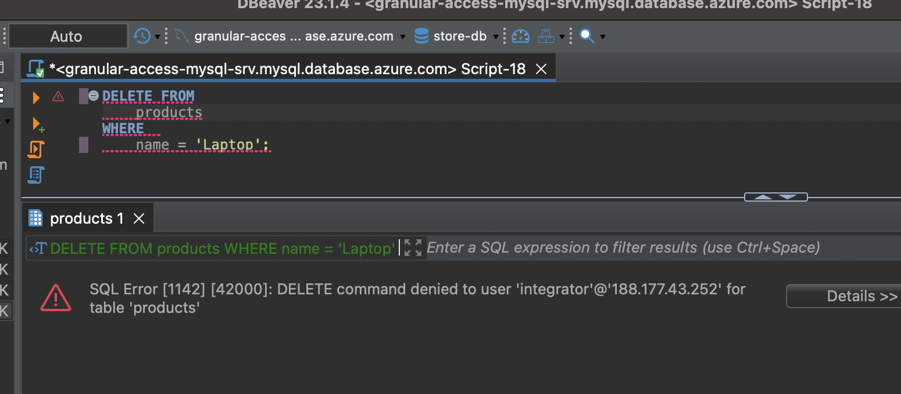

# Feedback

Setup went good, and i was able to view all tables:

## Users Table

Accessing allowed columns:

Trying to access all columns failed, as expected:

Trying to update i also got denied:

## Products Table

Accessing all allowed columns, `*` allowed here.

Updating was allowed on the specific fields:

Updating other fields, expected to get denied:

Deleting was also denied as expected:

## Order table

Selecting all orders:

Updating was allowed:

Insert was allowed:

Deleting was denied as expected:

## order_products

Selecting all orders was denied, i should be able to view it?

Updating  was denied, i should be able to update it?

Insert was denied, i should be able to insert?

Deleting was denied as expected:

