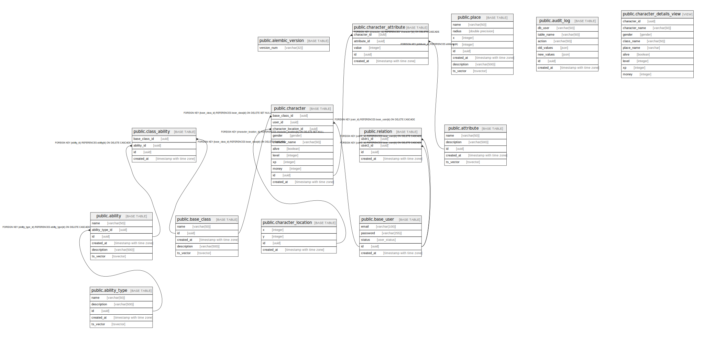

# rpg_api

## Tables

| Name | Columns | Comment | Type |
| ---- | ------- | ------- | ---- |
| [public.alembic_version](public.alembic_version.md) | 1 |  | BASE TABLE |
| [public.ability_type](public.ability_type.md) | 5 |  | BASE TABLE |
| [public.attribute](public.attribute.md) | 5 |  | BASE TABLE |
| [public.base_class](public.base_class.md) | 5 |  | BASE TABLE |
| [public.base_user](public.base_user.md) | 5 |  | BASE TABLE |
| [public.character_location](public.character_location.md) | 4 |  | BASE TABLE |
| [public.place](public.place.md) | 8 |  | BASE TABLE |
| [public.ability](public.ability.md) | 6 |  | BASE TABLE |
| [public.character](public.character.md) | 11 |  | BASE TABLE |
| [public.relation](public.relation.md) | 4 |  | BASE TABLE |
| [public.class_ability](public.class_ability.md) | 4 |  | BASE TABLE |
| [public.character_attribute](public.character_attribute.md) | 5 |  | BASE TABLE |
| [public.audit_log](public.audit_log.md) | 7 |  | BASE TABLE |
| [public.character_details_view](public.character_details_view.md) | 9 |  | VIEW |

## Stored procedures and functions

| Name | ReturnType | Arguments | Type |
| ---- | ------- | ------- | ---- |
| public.audit_trigger_func | trigger |  | FUNCTION |
| public.citextin | citext | cstring | FUNCTION |
| public.citextout | cstring | citext | FUNCTION |
| public.citextrecv | citext | internal | FUNCTION |
| public.citextsend | bytea | citext | FUNCTION |
| public.citext | citext | character | FUNCTION |
| public.citext | citext | boolean | FUNCTION |
| public.citext | citext | inet | FUNCTION |
| public.citext_eq | bool | citext, citext | FUNCTION |
| public.citext_ne | bool | citext, citext | FUNCTION |
| public.citext_lt | bool | citext, citext | FUNCTION |
| public.citext_le | bool | citext, citext | FUNCTION |
| public.citext_gt | bool | citext, citext | FUNCTION |
| public.citext_ge | bool | citext, citext | FUNCTION |
| public.citext_cmp | int4 | citext, citext | FUNCTION |
| public.citext_hash | int4 | citext | FUNCTION |
| public.citext_smaller | citext | citext, citext | FUNCTION |
| public.citext_larger | citext | citext, citext | FUNCTION |
| public.min | citext | citext | a |
| public.max | citext | citext | a |
| public.texticlike | bool | citext, citext | FUNCTION |
| public.texticnlike | bool | citext, citext | FUNCTION |
| public.texticregexeq | bool | citext, citext | FUNCTION |
| public.texticregexne | bool | citext, citext | FUNCTION |
| public.texticlike | bool | citext, text | FUNCTION |
| public.texticnlike | bool | citext, text | FUNCTION |
| public.texticregexeq | bool | citext, text | FUNCTION |
| public.texticregexne | bool | citext, text | FUNCTION |
| public.regexp_match | _text | citext, citext | FUNCTION |
| public.regexp_match | _text | citext, citext, text | FUNCTION |
| public.regexp_matches | _text | citext, citext | FUNCTION |
| public.regexp_matches | _text | citext, citext, text | FUNCTION |
| public.regexp_replace | text | citext, citext, text | FUNCTION |
| public.regexp_replace | text | citext, citext, text, text | FUNCTION |
| public.regexp_split_to_array | _text | citext, citext | FUNCTION |
| public.regexp_split_to_array | _text | citext, citext, text | FUNCTION |
| public.regexp_split_to_table | text | citext, citext | FUNCTION |
| public.regexp_split_to_table | text | citext, citext, text | FUNCTION |
| public.strpos | int4 | citext, citext | FUNCTION |
| public.replace | text | citext, citext, citext | FUNCTION |
| public.split_part | text | citext, citext, integer | FUNCTION |
| public.translate | text | citext, citext, text | FUNCTION |
| public.citext_pattern_lt | bool | citext, citext | FUNCTION |
| public.citext_pattern_le | bool | citext, citext | FUNCTION |
| public.citext_pattern_gt | bool | citext, citext | FUNCTION |
| public.citext_pattern_ge | bool | citext, citext | FUNCTION |
| public.citext_pattern_cmp | int4 | citext, citext | FUNCTION |
| public.citext_hash_extended | int8 | citext, bigint | FUNCTION |
| public.create_character_location | trigger |  | FUNCTION |
| public.calculate_distance | float8 | x1 integer, y1 integer, x2 integer, y2 integer | FUNCTION |
| public.get_character_location | record | c_id uuid | FUNCTION |
| public.get_character_place | varchar | c_id uuid | FUNCTION |
| public.check_place_overlap | trigger |  | FUNCTION |
| public.sp_insert_relation | void | p_user1_id uuid, p_user2_id uuid | PROCEDURE |

## Relations

---

> Generated by [tbls](https://github.com/k1LoW/tbls)
