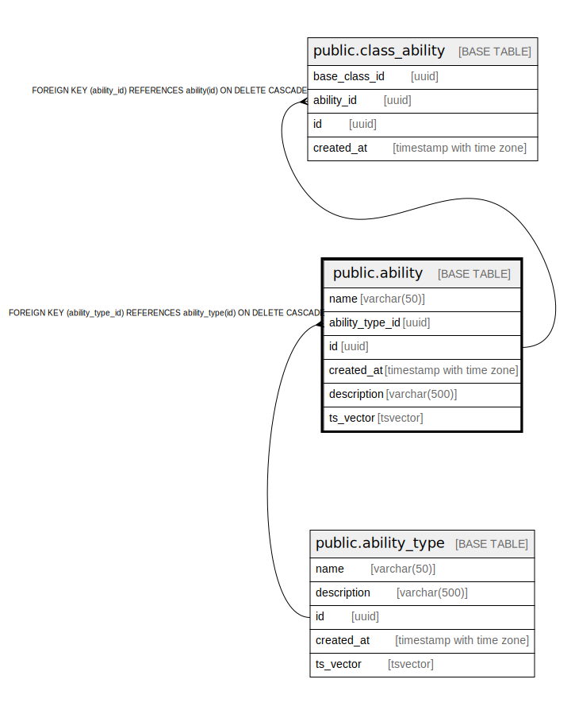

# public.ability

## Description

## Columns

| Name | Type | Default | Nullable | Extra Definition | Children | Parents | Comment |
| ---- | ---- | ------- | -------- | ---------------- | -------- | ------- | ------- |
| name | varchar(50) |  | false |  |  |  |  |
| ability_type_id | uuid |  | false |  |  | [public.ability_type](public.ability_type.md) |  |
| id | uuid |  | false |  | [public.class_ability](public.class_ability.md) |  |  |
| created_at | timestamp with time zone |  | false |  |  |  |  |
| description | varchar(500) |  | true |  |  |  |  |
| ts_vector | tsvector |  | true | GENERATED ALWAYS AS to_tsvector('english'::regconfig, (((name)::text || ' '::text) || (description)::text)) STORED |  |  |  |

## Constraints

| Name | Type | Definition |
| ---- | ---- | ---------- |
| ability_ability_type_id_fkey | FOREIGN KEY | FOREIGN KEY (ability_type_id) REFERENCES ability_type(id) ON DELETE CASCADE |
| ability_pkey | PRIMARY KEY | PRIMARY KEY (id) |
| ability_name_key | UNIQUE | UNIQUE (name) |

## Indexes

| Name | Definition |
| ---- | ---------- |
| ability_pkey | CREATE UNIQUE INDEX ability_pkey ON public.ability USING btree (id) |
| idx_ability_type_id | CREATE INDEX idx_ability_type_id ON public.ability USING btree (ability_type_id) |
| ability_name_key | CREATE UNIQUE INDEX ability_name_key ON public.ability USING btree (name) |
| idx_ability_name_description_ts_vector | CREATE INDEX idx_ability_name_description_ts_vector ON public.ability USING gin (ts_vector) |

## Triggers

| Name | Definition |
| ---- | ---------- |
| audit_log_trigger | CREATE TRIGGER audit_log_trigger AFTER INSERT OR DELETE OR UPDATE ON public.ability FOR EACH ROW EXECUTE FUNCTION audit_trigger_func() |

## Relations

---

> Generated by [tbls](https://github.com/k1LoW/tbls)
