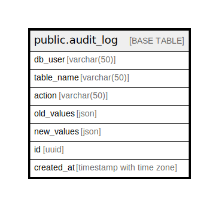

# public.audit_log

## Description

## Columns

| Name | Type | Default | Nullable | Children | Parents | Comment |
| ---- | ---- | ------- | -------- | -------- | ------- | ------- |
| db_user | varchar(50) |  | false |  |  |  |
| table_name | varchar(50) |  | false |  |  |  |
| action | varchar(50) |  | false |  |  |  |
| old_values | json |  | true |  |  |  |
| new_values | json |  | true |  |  |  |
| id | uuid |  | false |  |  |  |
| created_at | timestamp with time zone |  | false |  |  |  |

## Constraints

| Name | Type | Definition |
| ---- | ---- | ---------- |
| audit_log_pkey | PRIMARY KEY | PRIMARY KEY (id) |

## Indexes

| Name | Definition |
| ---- | ---------- |
| audit_log_pkey | CREATE UNIQUE INDEX audit_log_pkey ON public.audit_log USING btree (id) |
| idx_audit_log_db_user | CREATE INDEX idx_audit_log_db_user ON public.audit_log USING btree (db_user) |
| idx_audit_log_table_name | CREATE INDEX idx_audit_log_table_name ON public.audit_log USING btree (table_name) |

## Relations

---

> Generated by [tbls](https://github.com/k1LoW/tbls)
