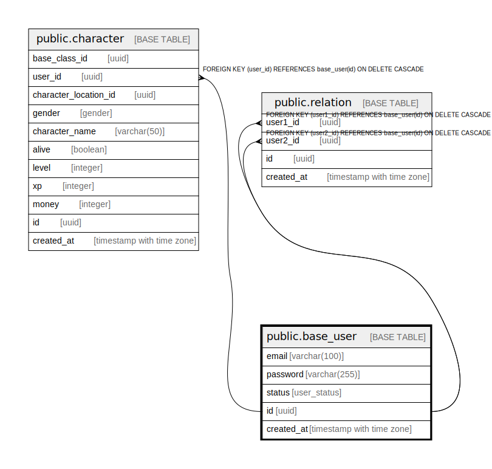

# public.base_user

## Description

## Columns

| Name | Type | Default | Nullable | Children | Parents | Comment |
| ---- | ---- | ------- | -------- | -------- | ------- | ------- |
| email | varchar(100) |  | false |  |  |  |
| password | varchar(255) |  | false |  |  |  |
| status | user_status |  | false |  |  |  |
| id | uuid |  | false | [public.character](public.character.md) [public.relation](public.relation.md) |  |  |
| created_at | timestamp with time zone |  | false |  |  |  |

## Constraints

| Name | Type | Definition |
| ---- | ---- | ---------- |
| base_user_pkey | PRIMARY KEY | PRIMARY KEY (id) |
| base_user_email_key | UNIQUE | UNIQUE (email) |

## Indexes

| Name | Definition |
| ---- | ---------- |
| base_user_pkey | CREATE UNIQUE INDEX base_user_pkey ON public.base_user USING btree (id) |
| base_user_email_key | CREATE UNIQUE INDEX base_user_email_key ON public.base_user USING btree (email) |
| idx_base_user_email | CREATE INDEX idx_base_user_email ON public.base_user USING btree (email) |
| idx_base_user_status | CREATE INDEX idx_base_user_status ON public.base_user USING btree (status) |

## Triggers

| Name | Definition |
| ---- | ---------- |
| audit_log_trigger | CREATE TRIGGER audit_log_trigger AFTER INSERT OR DELETE OR UPDATE ON public.base_user FOR EACH ROW EXECUTE FUNCTION audit_trigger_func() |

## Relations

---

> Generated by [tbls](https://github.com/k1LoW/tbls)
