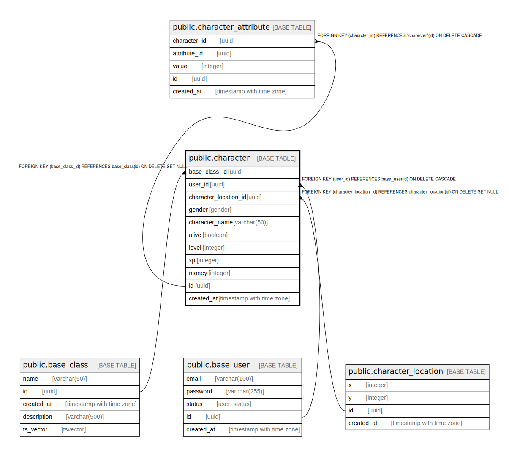

# public.character

## Description

## Columns

| Name | Type | Default | Nullable | Children | Parents | Comment |
| ---- | ---- | ------- | -------- | -------- | ------- | ------- |
| base_class_id | uuid |  | true |  | [public.base_class](public.base_class.md) |  |
| user_id | uuid |  | false |  | [public.base_user](public.base_user.md) |  |
| character_location_id | uuid |  | true |  | [public.character_location](public.character_location.md) |  |
| gender | gender |  | false |  |  |  |
| character_name | varchar(50) |  | false |  |  |  |
| alive | boolean |  | false |  |  |  |
| level | integer |  | false |  |  |  |
| xp | integer |  | false |  |  |  |
| money | integer |  | false |  |  |  |
| id | uuid |  | false | [public.character_attribute](public.character_attribute.md) |  |  |
| created_at | timestamp with time zone |  | false |  |  |  |

## Constraints

| Name | Type | Definition |
| ---- | ---- | ---------- |
| character_base_class_id_fkey | FOREIGN KEY | FOREIGN KEY (base_class_id) REFERENCES base_class(id) ON DELETE SET NULL |
| character_user_id_fkey | FOREIGN KEY | FOREIGN KEY (user_id) REFERENCES base_user(id) ON DELETE CASCADE |
| character_character_location_id_fkey | FOREIGN KEY | FOREIGN KEY (character_location_id) REFERENCES character_location(id) ON DELETE SET NULL |
| character_pkey | PRIMARY KEY | PRIMARY KEY (id) |
| character_character_name_key | UNIQUE | UNIQUE (character_name) |

## Indexes

| Name | Definition |
| ---- | ---------- |
| character_pkey | CREATE UNIQUE INDEX character_pkey ON public."character" USING btree (id) |
| idx_character_level | CREATE INDEX idx_character_level ON public."character" USING btree (level) |
| idx_character_name | CREATE INDEX idx_character_name ON public."character" USING btree (character_name) |
| character_character_name_key | CREATE UNIQUE INDEX character_character_name_key ON public."character" USING btree (character_name) |
| idx_character_user_id | CREATE INDEX idx_character_user_id ON public."character" USING btree (user_id) |

## Triggers

| Name | Definition |
| ---- | ---------- |
| audit_log_trigger | CREATE TRIGGER audit_log_trigger AFTER INSERT OR DELETE OR UPDATE ON public."character" FOR EACH ROW EXECUTE FUNCTION audit_trigger_func() |
| character_insert_trigger | CREATE TRIGGER character_insert_trigger AFTER INSERT ON public."character" FOR EACH ROW EXECUTE FUNCTION create_character_location() |

## Relations

---

> Generated by [tbls](https://github.com/k1LoW/tbls)
