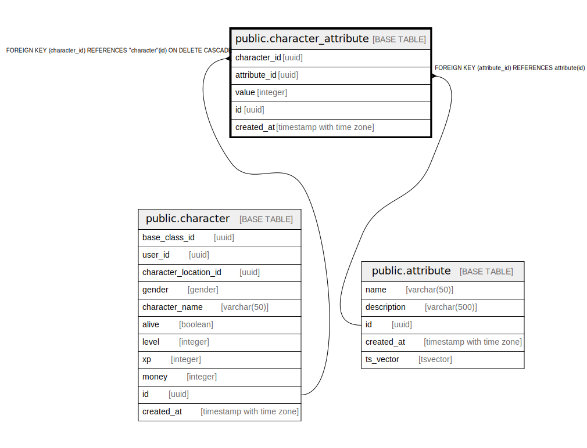

# public.character_attribute

## Description

## Columns

| Name | Type | Default | Nullable | Children | Parents | Comment |
| ---- | ---- | ------- | -------- | -------- | ------- | ------- |
| character_id | uuid |  | false |  | [public.character](public.character.md) |  |
| attribute_id | uuid |  | false |  | [public.attribute](public.attribute.md) |  |
| value | integer |  | false |  |  |  |
| id | uuid |  | false |  |  |  |
| created_at | timestamp with time zone |  | false |  |  |  |

## Constraints

| Name | Type | Definition |
| ---- | ---- | ---------- |
| character_attribute_attribute_id_fkey | FOREIGN KEY | FOREIGN KEY (attribute_id) REFERENCES attribute(id) |
| character_attribute_character_id_fkey | FOREIGN KEY | FOREIGN KEY (character_id) REFERENCES "character"(id) ON DELETE CASCADE |
| character_attribute_pkey | PRIMARY KEY | PRIMARY KEY (id) |

## Indexes

| Name | Definition |
| ---- | ---------- |
| character_attribute_pkey | CREATE UNIQUE INDEX character_attribute_pkey ON public.character_attribute USING btree (id) |

## Relations

---

> Generated by [tbls](https://github.com/k1LoW/tbls)
