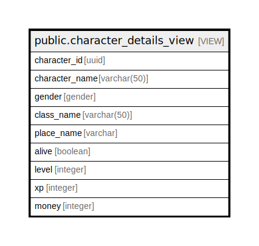

# public.character_details_view

## Description

<details>
<summary><strong>Table Definition</strong></summary>

```sql
CREATE VIEW character_details_view AS (
 SELECT c.id AS character_id,
    c.character_name,
    c.gender,
    bc.name AS class_name,
    get_character_place(c.id) AS place_name,
    c.alive,
    c.level,
    c.xp,
    c.money
   FROM ("character" c
     JOIN base_class bc ON ((c.base_class_id = bc.id)))
)
```

</details>

## Referenced Tables

- "character"
- [public.base_class](public.base_class.md)

## Columns

| Name | Type | Default | Nullable | Children | Parents | Comment |
| ---- | ---- | ------- | -------- | -------- | ------- | ------- |
| character_id | uuid |  | true |  |  |  |
| character_name | varchar(50) |  | true |  |  |  |
| gender | gender |  | true |  |  |  |
| class_name | varchar(50) |  | true |  |  |  |
| place_name | varchar |  | true |  |  |  |
| alive | boolean |  | true |  |  |  |
| level | integer |  | true |  |  |  |
| xp | integer |  | true |  |  |  |
| money | integer |  | true |  |  |  |

## Relations



---

> Generated by [tbls](https://github.com/k1LoW/tbls)
