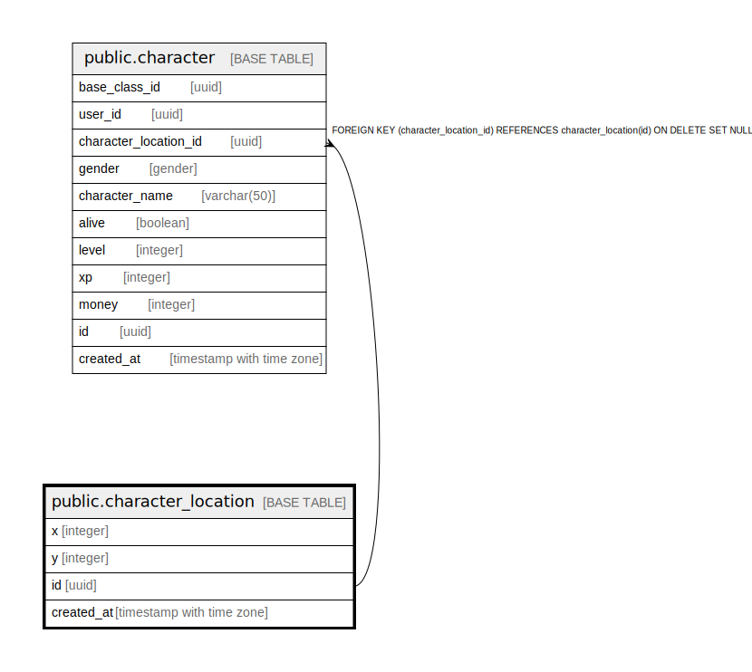

# public.character_location

## Description

## Columns

| Name | Type | Default | Nullable | Children | Parents | Comment |
| ---- | ---- | ------- | -------- | -------- | ------- | ------- |
| x | integer |  | false |  |  |  |
| y | integer |  | false |  |  |  |
| id | uuid |  | false | [public.character](public.character.md) |  |  |
| created_at | timestamp with time zone |  | false |  |  |  |

## Constraints

| Name | Type | Definition |
| ---- | ---- | ---------- |
| character_location_pkey | PRIMARY KEY | PRIMARY KEY (id) |

## Indexes

| Name | Definition |
| ---- | ---------- |
| character_location_pkey | CREATE UNIQUE INDEX character_location_pkey ON public.character_location USING btree (id) |

## Relations

---

> Generated by [tbls](https://github.com/k1LoW/tbls)
