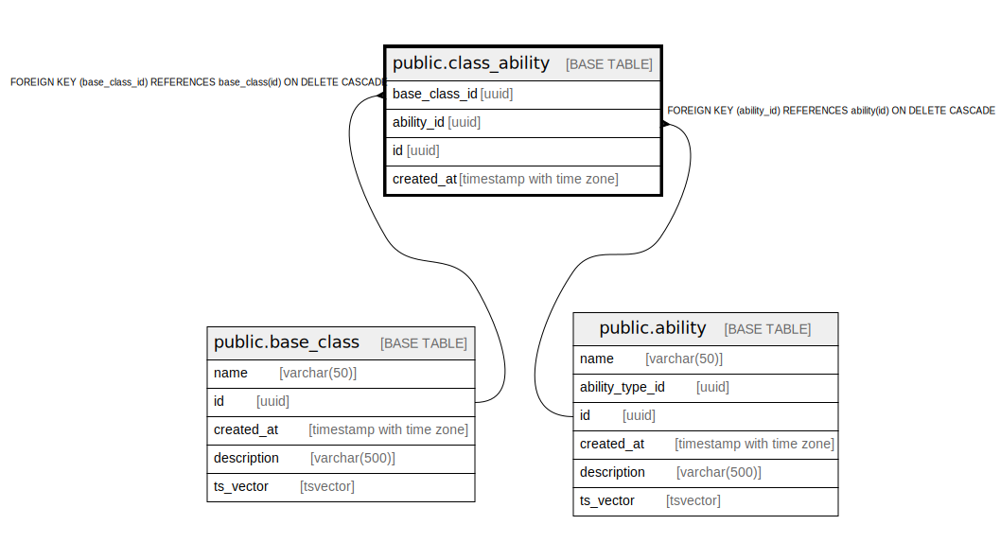

# public.class_ability

## Description

## Columns

| Name | Type | Default | Nullable | Children | Parents | Comment |
| ---- | ---- | ------- | -------- | -------- | ------- | ------- |
| base_class_id | uuid |  | false |  | [public.base_class](public.base_class.md) |  |
| ability_id | uuid |  | false |  | [public.ability](public.ability.md) |  |
| id | uuid |  | false |  |  |  |
| created_at | timestamp with time zone |  | false |  |  |  |

## Constraints

| Name | Type | Definition |
| ---- | ---- | ---------- |
| class_ability_base_class_id_fkey | FOREIGN KEY | FOREIGN KEY (base_class_id) REFERENCES base_class(id) ON DELETE CASCADE |
| class_ability_ability_id_fkey | FOREIGN KEY | FOREIGN KEY (ability_id) REFERENCES ability(id) ON DELETE CASCADE |
| class_ability_pkey | PRIMARY KEY | PRIMARY KEY (id) |

## Indexes

| Name | Definition |
| ---- | ---------- |
| class_ability_pkey | CREATE UNIQUE INDEX class_ability_pkey ON public.class_ability USING btree (id) |
| idx_class_ability_ability_id | CREATE INDEX idx_class_ability_ability_id ON public.class_ability USING btree (ability_id) |
| idx_class_ability_base_class_id | CREATE INDEX idx_class_ability_base_class_id ON public.class_ability USING btree (base_class_id) |

## Triggers

| Name | Definition |
| ---- | ---------- |
| audit_log_trigger | CREATE TRIGGER audit_log_trigger AFTER INSERT OR DELETE OR UPDATE ON public.class_ability FOR EACH ROW EXECUTE FUNCTION audit_trigger_func() |

## Relations

---

> Generated by [tbls](https://github.com/k1LoW/tbls)
