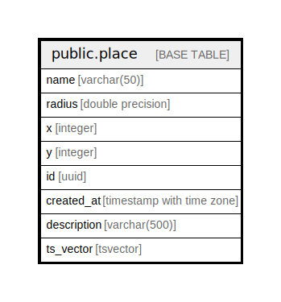

# public.place

## Description

## Columns

| Name | Type | Default | Nullable | Extra Definition | Children | Parents | Comment |
| ---- | ---- | ------- | -------- | ---------------- | -------- | ------- | ------- |
| name | varchar(50) |  | false |  |  |  |  |
| radius | double precision |  | false |  |  |  |  |
| x | integer |  | false |  |  |  |  |
| y | integer |  | false |  |  |  |  |
| id | uuid |  | false |  |  |  |  |
| created_at | timestamp with time zone |  | false |  |  |  |  |
| description | varchar(500) |  | true |  |  |  |  |
| ts_vector | tsvector |  | true | GENERATED ALWAYS AS to_tsvector('english'::regconfig, (((name)::text || ' '::text) || (description)::text)) STORED |  |  |  |

## Constraints

| Name | Type | Definition |
| ---- | ---- | ---------- |
| place_pkey | PRIMARY KEY | PRIMARY KEY (id) |
| place_name_key | UNIQUE | UNIQUE (name) |

## Indexes

| Name | Definition |
| ---- | ---------- |
| place_pkey | CREATE UNIQUE INDEX place_pkey ON public.place USING btree (id) |
| place_name_key | CREATE UNIQUE INDEX place_name_key ON public.place USING btree (name) |
| idx_place_name_description_ts_vector | CREATE INDEX idx_place_name_description_ts_vector ON public.place USING gin (ts_vector) |

## Triggers

| Name | Definition |
| ---- | ---------- |
| check_place_overlap_trigger | CREATE TRIGGER check_place_overlap_trigger BEFORE INSERT ON public.place FOR EACH ROW EXECUTE FUNCTION check_place_overlap() |

## Relations

---

> Generated by [tbls](https://github.com/k1LoW/tbls)
