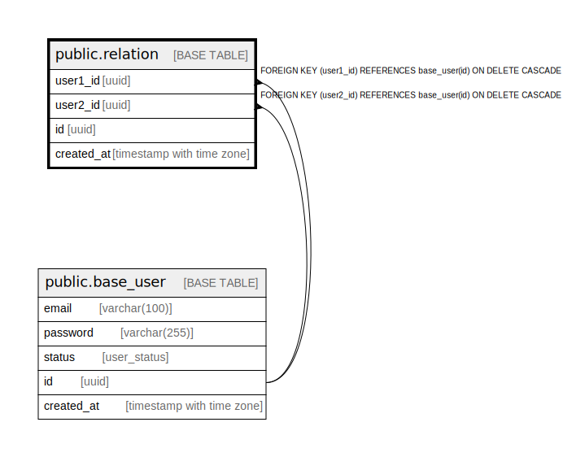

# public.relation

## Description

## Columns

| Name | Type | Default | Nullable | Children | Parents | Comment |
| ---- | ---- | ------- | -------- | -------- | ------- | ------- |
| user1_id | uuid |  | false |  | [public.base_user](public.base_user.md) |  |
| user2_id | uuid |  | false |  | [public.base_user](public.base_user.md) |  |
| id | uuid |  | false |  |  |  |
| created_at | timestamp with time zone |  | false |  |  |  |

## Constraints

| Name | Type | Definition |
| ---- | ---- | ---------- |
| relation_user1_id_fkey | FOREIGN KEY | FOREIGN KEY (user1_id) REFERENCES base_user(id) ON DELETE CASCADE |
| relation_user2_id_fkey | FOREIGN KEY | FOREIGN KEY (user2_id) REFERENCES base_user(id) ON DELETE CASCADE |
| relation_pkey | PRIMARY KEY | PRIMARY KEY (id) |
| uq_relation_user1_user2 | UNIQUE | UNIQUE (user1_id, user2_id) |

## Indexes

| Name | Definition |
| ---- | ---------- |
| relation_pkey | CREATE UNIQUE INDEX relation_pkey ON public.relation USING btree (id) |
| uq_relation_user1_user2 | CREATE UNIQUE INDEX uq_relation_user1_user2 ON public.relation USING btree (user1_id, user2_id) |

## Relations

---

> Generated by [tbls](https://github.com/k1LoW/tbls)
