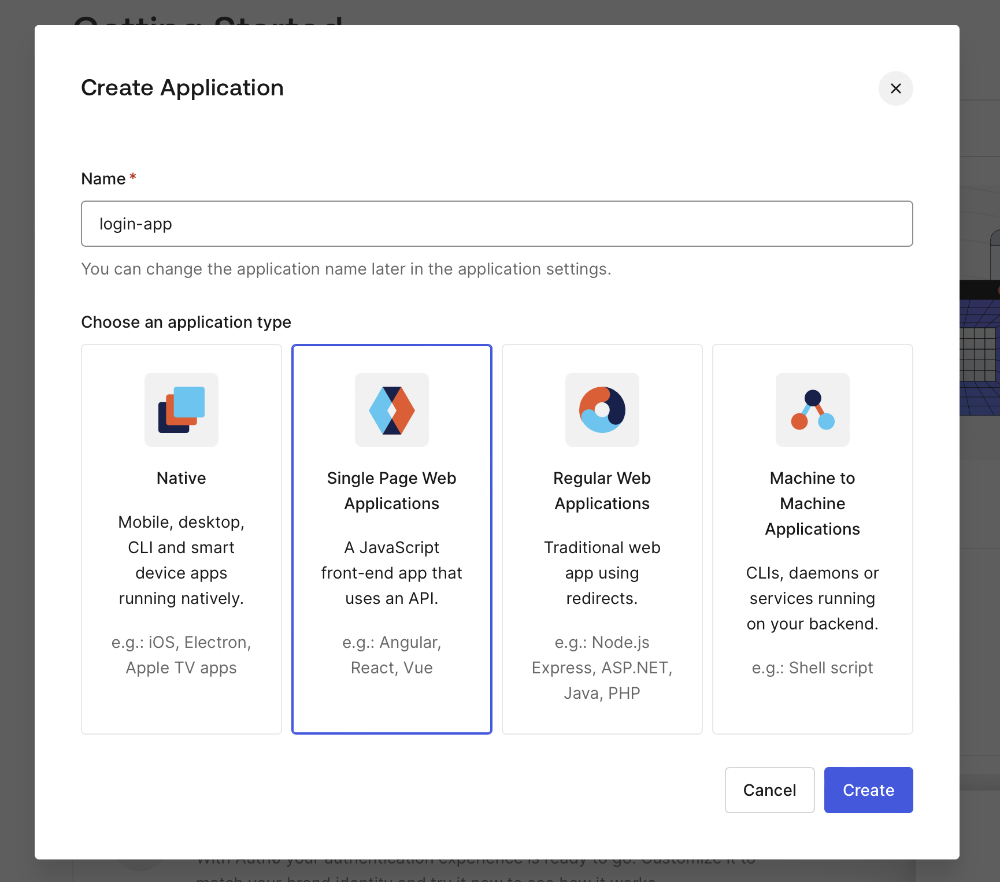
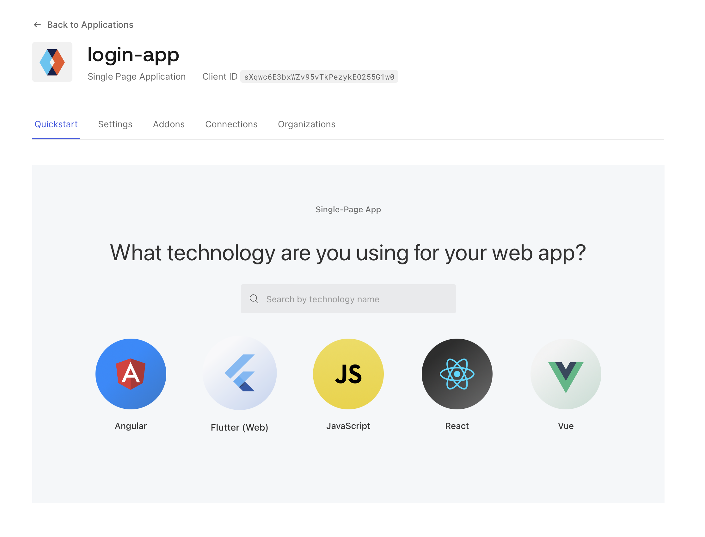
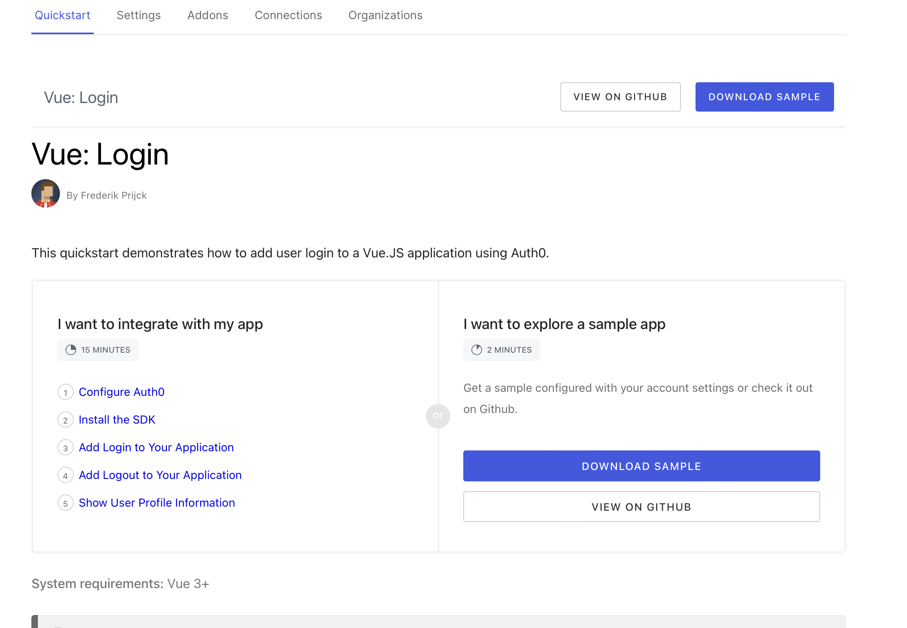
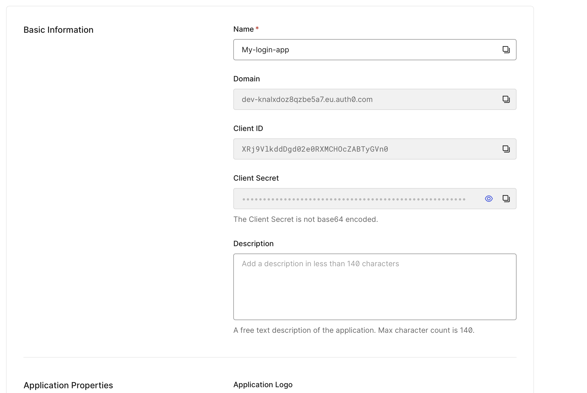
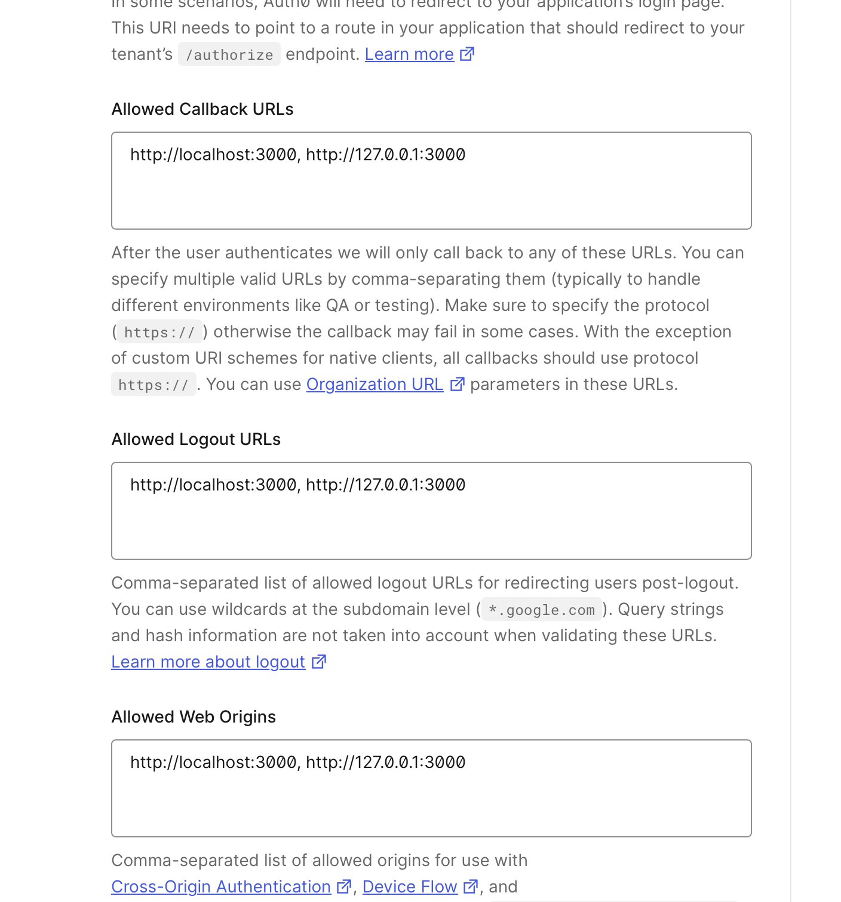
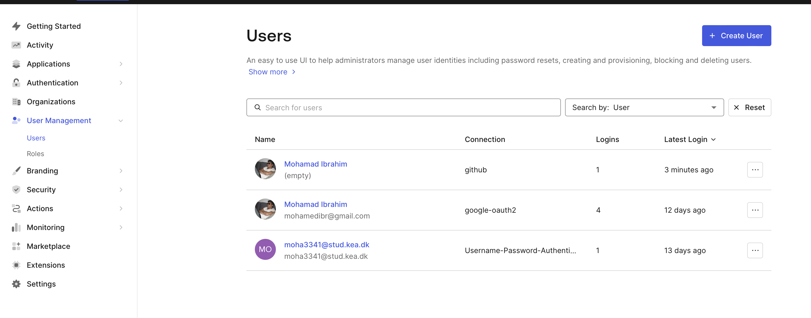

# Guide on how to set it up

I started by generating some frontent code using the their template:


I chose to use vue:


After this i could download the samlple app:



using this info i had to update the `auth_config.json` file:

```json
{
    "domain": "dev-knalxdoz8qzbe5a7.eu.auth0.com",
  "clientId": "XRj9VlkddDgd02e0RXMCHOcZABTyGVn0"
}
```


i also needed to add the valid callback urls:


now i can view users created from the website:


